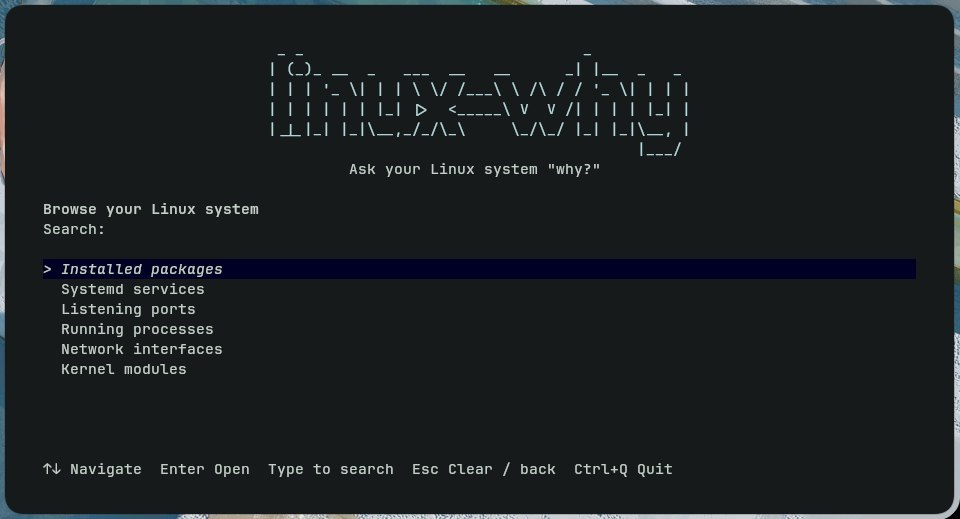

# linux-why

Ask your Linux system **“why is this here?”**

One local command connects packages, processes, services, sockets, files, interfaces,
and kernel modules into an evidence-backed graph. No cloud, LLM, telemetry, or daemon.

An abbreviated illustrative graph (actual PIDs, packages and relationships vary):

```text
$ linux-why :5353
Listening/bound sockets: :5353
└─ matches: UDP 0.0.0.0:5353
   └─ held by: avahi-daemon (PID 742)
      └─ member of: avahi-daemon.service
         └─ defined by: /usr/lib/systemd/system/avahi-daemon.service
            └─ owned by: package: avahi
```

## Direct and interactive modes

Run `linux-why` with a target for quick queries and scripting:

```sh
linux-why :22
linux-why :22 --json
```

Run `linux-why` without arguments to browse and search your Linux system interactively:

```sh
linux-why
```



Screenshot from a real terminal, provided by the project maintainer. The initial selection is **Installed packages**: Enter opens the package browser.
Use Ctrl+Q to quit. No mouse or Tab is needed.

**Arrow keys when browsing. Just type when searching.**

| Key | Action |
| --- | --- |
| ↑ / ↓ | Select an object; scroll in an explanation |
| Enter | Open the selection through the existing resolver |
| Printable characters, including `q` and Unicode | Start or extend search immediately |
| Backspace | Remove the last search character |
| Esc | Clear nonempty search; otherwise return to the previous view |
| Home / End / PageUp / PageDown | Navigate lists and explanations |
| F2 | Toggle evidence sources in an explanation without querying again |
| Ctrl+Q | Quit from anywhere |

Browsers cover installed packages, systemd services, listening ports, running
processes, network interfaces, and kernel modules. Global search filters their
session snapshots together with executables in absolute PATH directories. For
an arbitrary path, port expression or prefixed target, choose **Explain exact
target** in the results; the existing detector resolves it and exposes ambiguity.
This action does not assign a type before resolution.

Inventory is fetched lazily in background workers, once per category per session.
Typing filters locally; it does not invoke pacman, systemctl or scan procfs on each
keypress. Opening a result creates a fresh provenance query. Restart the TUI to
refresh browser snapshots. Missing commands or permissions leave available results
usable and show diagnostics. No sudo or network requests are introduced.

The banner uses `pyfiglet`'s **standard** font. A narrow or short terminal gets plain
`linux-why` instead of a clipped banner. The UI uses an ANSI palette and does not
require truecolor. SSH needs an allocated PTY and a supported TERM setting. Without
a TTY, or with TERM unset/`dumb`, interactive mode prints guidance and exits 2;
direct queries remain available. TUI exit is 0; partial-result warnings stay in the
explanation. `--json` and `explain` still require a target.

## Why?

Finding a listening port is only the first step. You may then need its process,
executable, service definition, package owner, and packages that require it.
`linux-why` joins these local facts without making you choose a diagnostic tool first.

It explains **observable relationships**, not intent. A package's current reverse
dependencies do not prove which application originally caused its installation.

## Installation

Python 3.12+ and Linux are required. Runtime dependencies are Textual and pyfiglet.
Direct mode imports neither TUI library at startup.
This repository is release-ready source, **not an assertion that a PyPI release exists**.
After a maintainer publishes a release:

```sh
pipx install linux-why
```

Today, from a checkout:

```sh
git clone https://github.com/uclonfor/linux-why.git
cd linux-why
pipx install .
```

Arch uses the installed `pacman`; `expac` is an optional cross-check. `systemctl`,
`ip` (iproute2), and `modinfo` (kmod) enrich the relevant targets. Missing commands
produce partial results. See [AUR packaging](packaging/README.md).

## Examples

`why` is provided as a shorter command alias for `linux-why`. Both are installed
as Python console scripts and run the same CLI, including TUI and ambiguity
selection. Existing installations need to reinstall/upgrade the package to get
`why`; no shell configuration is required.

```sh
linux-why firefox
# short form
why firefox
# interactive mode
why
```

```sh
linux-why firefox
linux-why package:libxcrypt-compat --depth 5
linux-why /usr/bin/bash
linux-why pid:1337
linux-why process:sshd
linux-why sshd.service
linux-why :5353
linux-why tcp:8080
linux-why 0.0.0.0:8000
linux-why '[::1]:3000'
linux-why lo
linux-why module:iwlwifi
linux-why explain /usr/bin/bash --verbose --no-color
linux-why :22 --json
```

A bare name can identify several objects. All discovered interpretations are shown,
with explicit prefixes to choose one. No interpretation is silently preferred.

## Supported targets

| Target | Evidence collected |
| --- | --- |
| Package | Version, explicit/dependency flag, current reverse dependency tree; Arch install date and recent log event |
| File | Type, ownership, bounded symlink chain, directly executing processes |
| Process/PID | Executable, argv, local UID/name, parent ancestry, cgroup unit, listening/bound sockets |
| systemd unit | Load/active/enabled state, main PID, ExecStart, fragment, drop-ins, aliases, dependencies and triggers |
| Port | TCP listeners or unconnected bound UDP sockets, IPv4/IPv6 address, socket inode, processes holding it |
| Interface | Operational/admin state, type, addresses, master, driver |
| Kernel module | Presence, load state, references, dependencies, holders, metadata, parameters, driver devices |

## How it works

An explicit syntax or query-driven detector selects an inspector. Seven small
inspectors contribute dataclass nodes, claims, and directed edges to one graph.
A query-scoped context prevents cycles and caches external commands. The renderer
walks the same graph used by JSON consumers.

Every claim has a source and `confirmed`, `inferred`, or `unknown` confidence.
`--verbose` exposes evidence; unconfirmed claims are marked even in normal output.
Confirmed means **observed in that source**, not a transactionally consistent snapshot.

`pacman -Qi` has no JSON mode; the backend uses a C locale and parses anchored
fields with continuation lines. `systemctl show` provides named properties. `/proc`
and `/sys` are read directly; interface details use `ip -j`. There is no root filesystem
scan, journal scan, or network operation. Direct mode does not acquire inventories;
interactive browsers explicitly request them once per session. User names come
from `/etc/passwd`, avoiding network-backed NSS lookups.

See [architecture and evidence semantics](docs/architecture.md) and
[upstream interface references](docs/sources.md).

## Supported distributions

- **Arch Linux and derivatives:** primary 0.1 target; pacman dependency provenance.
- **Debian/Ubuntu:** basic dpkg ownership/version only. Package results explicitly
  report missing install-reason/reverse-dependency support and return exit 3.
- **Fedora/RPM, Alpine and others:** package provenance not implemented; other
  inspectors continue to operate with partial results where package data is needed.

Arch behavior is covered by offline command/filesystem fixtures. A live Arch run
is required before declaring a release validated on Arch.

## JSON output

`--json` emits exactly one object to stdout. Diagnostics also go to stderr.
[Schema 1.0](linux_why/schema.json) is included in the Python package.

```json
{
  "schema_version": "1.0",
  "target": ":22",
  "detected_type": "socket",
  "roots": [],
  "nodes": [],
  "edges": [],
  "warnings": [],
  "partial": false,
  "candidates": [],
  "metadata": {"platform": "arch", "version": "0.1.1"}
}
```

This is a shape example, not a captured result. IDs are namespaced strings; process
PIDs and socket inodes are snapshot-local identities, not durable identifiers.
Unknown attributes may be absent. Consumers should tolerate new attributes and
relation names within schema 1.x.

Ambiguous direct queries open a compact chooser when both stdin and stdout are
TTYs with a usable `TERM`:

```text
Multiple interpretations found:

> package      firefox
  executable   /usr/bin/firefox

↑↓ Select  Enter Explain  1–9 Quick select  Esc / Ctrl+C Cancel
```

The first interpretation is selected immediately. Enter explains that explicit
target using the normal CLI renderer; keys 1–9 open the corresponding option.
Esc, Ctrl+C or Ctrl+Q cancel selection with exit code 0. No main TUI screen is
opened. Browsers already pass typed targets and do not ask you to choose again.

`--json`, redirected stdin/stdout and `TERM=dumb` never open the chooser.
They retain the existing ambiguity result (exit 2). JSON schema 1.0 retains
`detected_type: "ambiguous"` and `candidates` containing `type`, `value`, and
`label`; text output lists explicit targets for a subsequent invocation.
`linux-why package:firefox` always bypasses ambiguity selection.

Exit codes: **0** result or cancelled selection, **1** not found, **2** invalid usage or ambiguity,
**3** incomplete observations due to permissions, unsupported backends, unavailable
sources or exhausted work budgets. An inconclusive query can return 3 without roots.
An interrupt during diagnosis returns **130**.
A requested depth boundary is reported but does not itself make a result partial.

## Permissions

Run as your regular user. The tool never invokes sudo, runs a discovered executable,
or modifies system configuration. `/proc` access restrictions can hide ownership;
readable socket and interface data remain useful. Container and network namespace
boundaries limit observations to the current view. Colors require a TTY and respect
`NO_COLOR` and `--no-color`. Terminal control characters from system data are escaped.

## Limitations

- Current dependency relationships are not installation history. The last 1 MiB of
  the standard pacman log is optional context, not a full audit trail. Custom pacman
  log paths and rotated logs are not searched.
- Kernel/procfs observations race with running processes. Start-time checks reject
  detected PID reuse; no cross-subsystem atomic snapshot is possible.
- Only the current network namespace is inspected. UDP has no TCP-style LISTEN;
  only unconnected bound UDP sockets are included. A file descriptor holder need
  not be the process that originally opened the socket.
- Interface names do not prove a creator. 0.1 reports no guessed Docker/VM/VPN
  manager. Historical interface creators generally cannot be recovered from sysfs.
- User-manager systemd units are recorded as cgroup membership but are not queried
  over a user bus. `WantedBy` is a current unit relation, not proof of enablement
  history. `After` is ordering, never a causal start edge.
- File queries find directly executing processes, not all mmap users or every unit
  text reference. Unit-file queries and linked processes supply unit context.
- Module metadata describes the currently installed module file, which may differ
  from a loaded module after an upgrade. Built-ins may lack modinfo metadata.
- Limits: depth 0–10 (default 5), 250 graph nodes, 100 external commands, 3 seconds
  per command, 15 seconds total external-command time, 1 MiB per filesystem read. Process FD discovery is proportional to
  visible processes and their open FDs. Large results are marked partial.
- Command lines may contain secrets. Review JSON before sharing it.

## Development

Clone your fork's repository URL, then:

```sh
cd linux-why
python -m venv .venv
source .venv/bin/activate
pip install -e '.[dev]'
ruff check .
ruff format --check .
mypy
pytest
python -m build
```

Tests use injectable command and filesystem readers. Integration tests use only local
read operations and skip when facilities are unavailable. CI runs Python 3.12 and 3.13.
See [CONTRIBUTING.md](CONTRIBUTING.md).

## Roadmap

Complete apt/dpkg and rpm/dnf provenance; evidence-based network manager adapters;
user systemd manager support; namespace selection; additional recorded Arch fixtures.

## License

[MIT](LICENSE).
